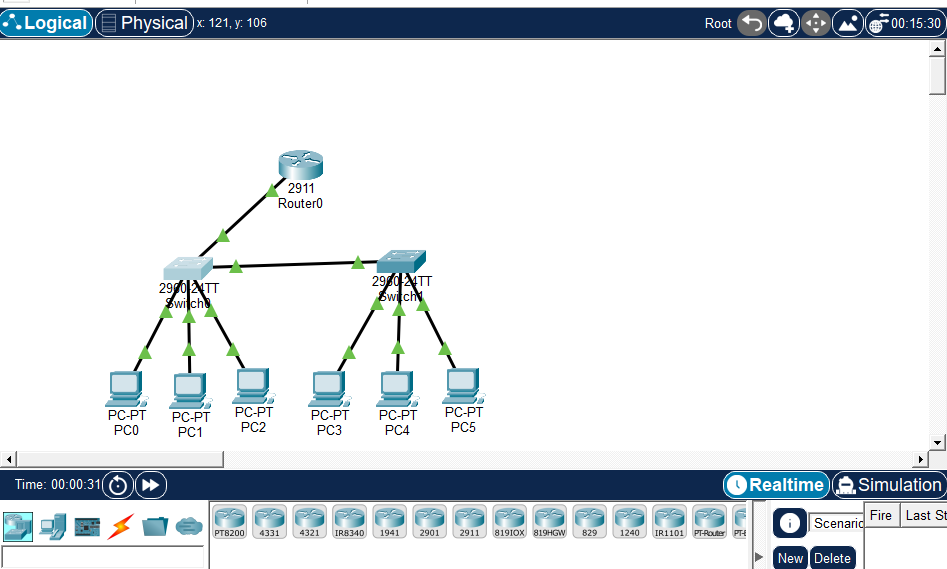
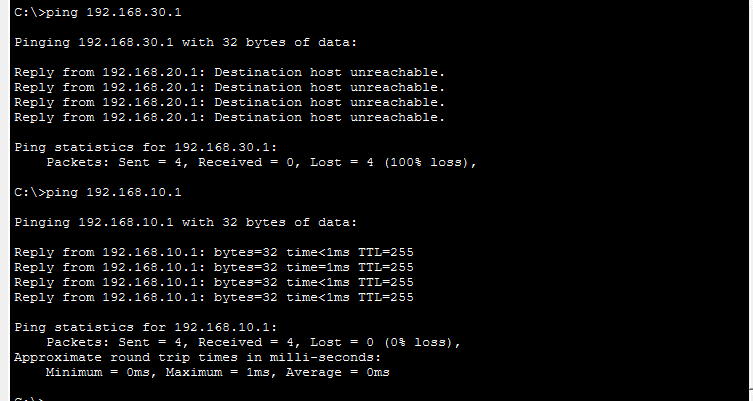
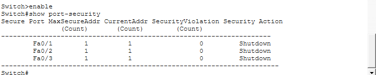

# 🔐 Çok Katmanlı LAN Topolojisi: VLAN Segmentasyonu, ACL ve Port Security

## 📋 Proje Özeti

Cisco Packet Tracer kullanılarak hiyerarşik bir kurumsal ağ topolojisi tasarlanmıştır. Ağ güvenliği odaklı bu projede VLAN segmentasyonu, DHCP, Inter-VLAN Routing, ACL tabanlı erişim kontrolü ve Port Security uygulanmıştır.

---

## 🛠️ Kullanılan Teknolojiler

- Cisco Packet Tracer
- Cisco IOS (2911 Router, 2960 Switch)
- VLAN (Virtual LAN)
- DHCP (Dynamic Host Configuration Protocol)
- Inter-VLAN Routing (Router-on-a-Stick)
- ACL (Access Control List)
- Port Security

---

## 🏗️ Topoloji

```
              [Router0 - 2911]
                     |
              [Switch0 - 2960]
             /                \
      [Switch1 - 2960]    PC0, PC1, PC2
      /     |     \
   PC3     PC4    PC5
```

### Topoloji Ekran Görüntüsü


---

## 📡 VLAN Yapılandırması

| VLAN | Ad | IP Aralığı | Cihazlar |
|------|----|-----------|---------|
| VLAN 10 | Yönetim | 192.168.10.0/24 | PC0, PC3 |
| VLAN 20 | Kullanıcılar | 192.168.20.0/24 | PC1, PC4 |
| VLAN 30 | Sunucular | 192.168.30.0/24 | PC2, PC5 |

---

## ⚙️ Yapılandırma Adımları

### 1. VLAN Tanımlama (Her Switch)
```
vlan 10
 name Yonetim
vlan 20
 name Kullanicilar
vlan 30
 name Sunucular
```

### 2. Port Atamaları
```
interface fastEthernet 0/1
 switchport mode access
 switchport access vlan 10

interface gigabitEthernet 0/1
 switchport mode trunk
```

### 3. Router Subinterface (Inter-VLAN Routing)
```
interface gigabitEthernet 0/0.10
 encapsulation dot1Q 10
 ip address 192.168.10.1 255.255.255.0

interface gigabitEthernet 0/0.20
 encapsulation dot1Q 20
 ip address 192.168.20.1 255.255.255.0

interface gigabitEthernet 0/0.30
 encapsulation dot1Q 30
 ip address 192.168.30.1 255.255.255.0
```

### 4. DHCP Yapılandırması
```
ip dhcp pool VLAN10
 network 192.168.10.0 255.255.255.0
 default-router 192.168.10.1

ip dhcp pool VLAN20
 network 192.168.20.0 255.255.255.0
 default-router 192.168.20.1

ip dhcp pool VLAN30
 network 192.168.30.0 255.255.255.0
 default-router 192.168.30.1
```

### 5. ACL Yapılandırması
```
ip access-list extended VLAN20_BLOCK
 deny ip 192.168.20.0 0.0.0.255 192.168.30.0 0.0.0.255
 permit ip any any

interface gigabitEthernet 0/0.20
 ip access-group VLAN20_BLOCK in
```

### 6. Port Security
```
interface fastEthernet 0/1
 switchport port-security
 switchport port-security maximum 1
 switchport port-security mac-address <MAC>
 switchport port-security violation shutdown
```

---

## 🧪 Test Sonuçları

### ACL Testi (PC1 - VLAN 20)


| Hedef | Sonuç | Açıklama |
|-------|-------|---------|
| 192.168.30.1 (VLAN 30) | ❌ Engellendi | ACL kuralı devrede |
| 192.168.10.1 (VLAN 10) | ✅ Başarılı | Erişime izin var |

### Port Security Durumu


| Port | Max MAC | Mevcut MAC | İhlal | Aksiyon |
|------|---------|-----------|-------|---------|
| Fa0/1 | 1 | 1 | 0 | Shutdown |
| Fa0/2 | 1 | 1 | 0 | Shutdown |
| Fa0/3 | 1 | 1 | 0 | Shutdown |

---

## 🔐 Siber Güvenlik Perspektifi

Bu projede uygulanan güvenlik prensipleri:

- **Network Segmentation:** VLAN'lar ile ağ bölümlere ayrılmıştır. Bir VLAN'da yaşanan güvenlik ihlali diğerlerini etkilemez.
- **En Az Ayrıcalık İlkesi (Least Privilege):** Kullanıcı VLAN'ı (VLAN 20) sunuculara (VLAN 30) doğrudan erişemez.
- **Port Security:** Yetkisiz cihaz bağlantısı anında portu kapatır, fiziksel erişim kontrolü sağlar.
- **DHCP Kontrolü:** IP dağıtımı merkezi olarak yönetilir, yetkisiz IP kullanımı engellenir.

---

## 📁 Dosyalar

| Dosya | Açıklama |
|-------|---------|
| `lan_topoloji.pkt` | Cisco Packet Tracer proje dosyası |
| `topology.png` | Ağ topolojisi görüntüsü |
| `acl_test.png` | ACL test sonuçları |
| `port_security.png` | Port security durumu |
